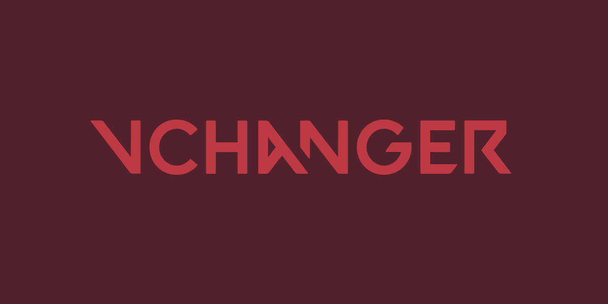
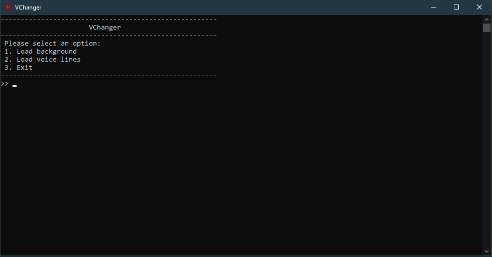
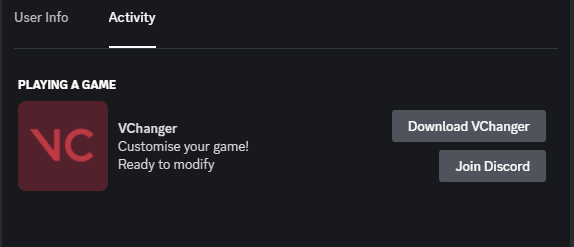
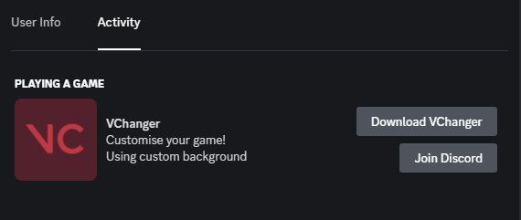
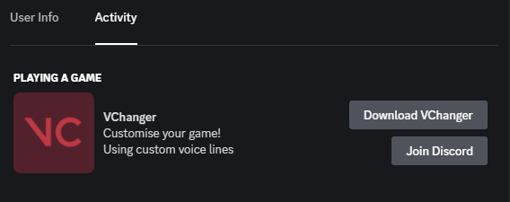

# VChanger
 

# Customise your game!
##### Make any video your Valorant main menu background or use your favourite language for voice lines and keep the text language in english using VChanger!

  
# Preview
## APP
### MAIN

## Discord RPC
### Status: Ready

### Status: Custom background

### Status: Custom voice lines

## Custom background
https://user-images.githubusercontent.com/42284544/216765943-a2161b4c-ace0-4db3-93ec-6d13ed625cfb.mp4

# Requirements

- [x] 25 MB RAM

- [x] 25 MB disk space

  

# Usage
1. Download VChanger from the latest [releases](https://github.com/OfficialQode/VChanger/releases/tag/Latest)
2. Execute `VChanger.exe`
3. Use the menu to choose between custom background and voice lines
    
# Guides

## How do I use a custom background?
    1. Download your background video and rename it to video.mp4
    2. Copy it into the VChanger folder
    3. Paste your path to the Valorant content folder into the path.txt file
        default should be -> C:\Riot Games\VALORANT\live\ShooterGame\Content
    4. Login to Valorant (Riot Client) and run the "VChanger.exe"
    5. Press 1 to load your background to the game
    6. Enjoy your custom background

## How do I use custom voice lines with english text?
    1. Go to Riot client settings -> Valorant
    2. Choose game text language, this will be your voice line language
    3. Login to Valorant (Riot Client) and run the "VChanger.exe"
    4. Press 2 to load custom voice lines
    5. Enjoy your favourite voice lines with english text

# Features
- [x]  Discord RPC
- [x]  Tested in all game modes
- [x]  No ban
- [x]  Easy to use
  

# FAQ

  

## Can I get banned for using VChanger?

You will not be banned directly for changing the background or voice lines, but this is an intrusion into the game files and can lead to your account being flagged. However, all tests have been successful and no account has been banned.

A Valorant subreddit mod said that they had reached out to Riot Support to find out if it's allowed and the team “strongly recommended” that players not change the background. Tampering with a game file can lead to permanent bans.

**IMPORTANT:**

Remember, however, that each player is responsible for the actions on his account. If you choose to use VChanger, it is your responsibility if you get banned for using it. I do not take any responsibility for any damage caused.

#

> Made with ♥ by Qode
